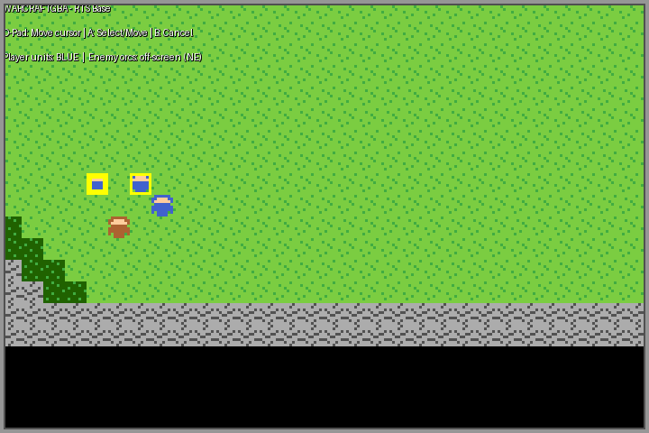

# crispy-palm-tree – GBA RTS Base

A Game Boy Advance ROM project: a simplified real-time strategy game inspired by
early Warcraft titles.

## Game concept

* Tile-based, scrollable **64 × 32 tile map** (512 × 256 px) with five terrain
  types: Grass, Water, Forest, Mountain and Dirt.
* **Player units** – 3 Footmen (blue) + 1 Peasant (brown) – start in the
  south-west of the map.
* **Enemy units** – 3 Orcs (green/red) – start in the north-east.
* A **yellow cursor** indicates the current tile under the player's control.

## Controls

| Button | Action |
|--------|--------|
| D-Pad | Move cursor / camera follows |
| **A** | Select player unit at cursor, OR issue a move command when a unit is already selected, OR attack an enemy at the cursor tile |
| **B** | Deselect current unit / cancel |

## Screenshot preview



> Preview rendered from palette and tile data – shows the 240 × 160 GBA screen
> at 3× scale.

## Building

### Requirements

```
sudo apt-get install gcc-arm-none-eabi binutils-arm-none-eabi
```

### Compile

```bash
make
```

This produces **`warcraftgba.gba`** (a valid GBA ROM binary, ~5–6 KB).

### Play

Open `warcraftgba.gba` in any GBA emulator that supports `.gba` ROMs, such as:

* [mGBA](https://mgba.io/) *(recommended)*
* [VisualBoyAdvance-M](https://vba-m.com/)
* [RetroArch](https://www.retroarch.com/) with the mGBA core

```bash
mgba warcraftgba.gba
```

## Project structure

```
.
├── Makefile              Build system (arm-none-eabi-gcc)
├── gba_cart.ld           GBA cartridge linker script
├── source/
│   ├── crt0.s            ARM startup code + GBA ROM header
│   ├── gba.h             Hardware register definitions, types, helpers
│   ├── tiles.h           BG tile and OBJ sprite pixel data + palettes
│   ├── video.h / .c      Display initialisation (VRAM, palette upload)
│   ├── input.h / .c      Button debounce and edge detection
│   ├── map.h / .c        Tile map data and BG scroll management
│   ├── unit.h / .c       Unit state, tile-step movement, OAM rendering
│   ├── game.h / .c       Game logic: cursor, selection, move commands
│   └── main.c            Entry point and main loop
└── preview.png           Simulated screen preview
```

## Roadmap

The current commit establishes the playable base.  Planned additions:

- [ ] Simple enemy AI that walks toward player units
- [ ] HP bars rendered above each unit
- [ ] Resource collection (Peasant gathers gold from a Forest tile)
- [ ] Sound effects via GBA Direct Sound
- [ ] Multiple maps with a simple save/load system
